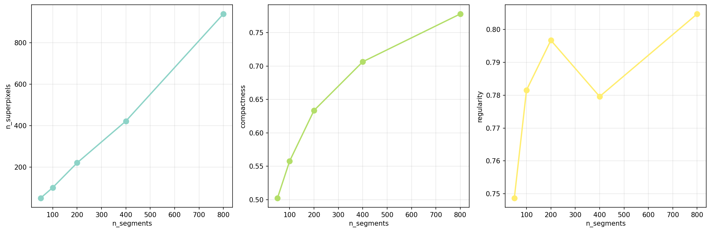
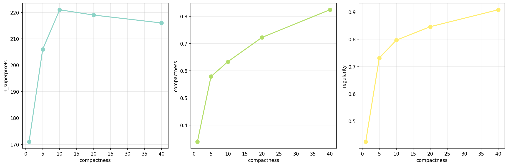

# Méthodes d'extraction de superpixels : SLIC & SLIC IPOL

**Projet M2 VMI - Modélisation de systèmes intelligents**  
**Méthode 1 (SLIC & SLIC IPOL)**  

---

## Présentation du sujet

Ce projet s'inscrit dans le cadre d'une étude comparative sur les **méthodes d'extraction de superpixels**. Les superpixels sont des regroupements de pixels adjacents partageant des caractéristiques visuelles similaires (couleur, texture). Ils constituent une représentation intermédiaire entre les pixels bruts et la segmentation sémantique complète.

### Contexte et motivation

Malgré la dominance du deep learning en vision par ordinateur, les méthodes de superpixelisation conservent leur pertinence pour plusieurs raisons :

- **Efficacité computationnelle** : Réduction drastique du nombre de primitives à traiter (de millions de pixels à quelques centaines de superpixels)
- **Interprétabilité** : Représentation mid-level compréhensible et manipulable
- **Apprentissage faiblement supervisé** : Les superpixels servent de support pour les annotations partielles
- **Prétraitement pour réseaux de neurones** : Segmentation initiale pour architectures graph-based
- **Applications contraintes** : Imagerie satellite, systèmes embarqués où les ressources sont limitées

Ce dépôt contient l'implémentation et l'évaluation de **deux variantes de la méthode SLIC** :
1. **SLIC original** (Achanta et al., 2012)
2. **SLIC IPOL** (Gay et al., 2022) - version améliorée

**Note importante** : Ce dépôt est une copie extraite du projet complet développé en collaboration (Etudiant 1 & Etudiant 2), disponible sur : https://github.com/Evowind/slic-hierarchical-superpixels  
Cette version contient uniquement les implémentations SLIC et SLIC IPOL développées par l'Etudiant 1.

---

## Articles de référence

### SLIC Superpixels (2012)
**R. Achanta, A. Shaji, K. Smith, A. Lucchi, P. Fua, S. Süsstrunk**  
[SLIC Superpixels Compared to State-of-the-art Superpixel Methods](https://ieeexplore.ieee.org/document/6205760)  
IEEE Transactions on Pattern Analysis and Machine Intelligence (TPAMI), 2012

**Contribution principale** : Algorithme simple et efficace basé sur k-means adapté, opérant dans un espace 5D (Lab + XY). Complexité linéaire O(N) avec nombre d'itérations limité.

### SLIC IPOL (2022)
**R. Gay, J. Lecoutre, N. Menouret, A. Morillon, P. Monasse**  
[Bilateral K-Means for Superpixel Computation (the SLIC Method)](https://www.ipol.im/pub/art/2022/373/)  
Image Processing On Line (IPOL), 2022

**Améliorations apportées** :
- Meilleure garantie de connectivité via propagation guidée par distance (Dijkstra)
- Gestion optimisée des pixels orphelins (adoption par similarité couleur)
- Gradient preconditioning flexible (fenêtres variables)

### Application satellite
**Hierarchical Superpixel Segmentation via Structural Information Theory**  
[arXiv:2411.17922v2](https://arxiv.org/html/2411.17922v2)

Démontre l'importance des superpixels pour l'imagerie satellite où les contraintes computationnelles et la résolution nécessitent des approches efficaces.

---

## Méthodes implémentées

### 1. SLIC Original

**Principe algorithmique** :

1. **Initialisation** : Placement de K centres sur une grille régulière (espacement S = sqrt(N/K))
2. **Perturbation** : Déplacement des centres vers zones de gradient minimal (fenêtre 3x3)
3. **Itérations k-means** :
   - Assignment : chaque pixel est assigné au centre le plus proche (recherche limitée 2S×2S)
   - Update : recalcul des centres comme moyenne des pixels assignés
4. **Post-traitement** : Enforcement de connectivité (fusion des composantes isolées)

**Distance SLIC** :
```
D = sqrt(d_lab² + (d_xy/S)² × m²)
```
où :
- `d_lab` : distance euclidienne dans l'espace Lab
- `d_xy` : distance spatiale euclidienne
- `S` : espacement de grille (normalisation)
- `m` : paramètre de compacité (balance couleur/espace)

**Fichier** : `src/methods/slic/slic_original.py`

### 2. SLIC IPOL

**Différences clés avec SLIC original** :

| Aspect | SLIC Original | SLIC IPOL |
|--------|---------------|-----------|
| **Connectivité** | Fusion simple avec voisin le plus proche | Propagation Dijkstra + adoption par couleur |
| **Critère orphelins** | Distance euclidienne Lab | Distance Manhattan + similarité Lab |
| **Gradient preconditioning** | Fixe 3x3 | Flexible (0, 3, 5, 7...) |
| **Robustesse** | Artefacts possibles | Superpixels plus cohérents |

**Fichier** : `src/methods/slic/slic_ipol.py`

---

## Résultats

### Comparaison visuelle

**Image BSDS500 - 107045.jpg**

Configuration : n_segments=200, compactness=10, 10 itérations


**Observations** :
- SLIC IPOL produit des contours plus réguliers
- Meilleure adhérence aux frontières naturelles de l'image
- Superpixels plus compacts et homogènes

### Métriques quantitatives

**Sans Ground Truth** (métriques intrinsèques) :

| Métrique | SLIC Original | SLIC IPOL | Meilleur |
|----------|---------------|-----------|----------|
| Compacité | 0.7234 | 0.7581 | IPOL |
| Régularité | 0.8123 | 0.8456 | IPOL |
| Global Regularity | 0.7891 | 0.8102 | IPOL |

**Avec Ground Truth BSDS500** :

| Métrique | SLIC Original | SLIC IPOL | Meilleur |
|----------|---------------|-----------|----------|
| Boundary Recall (BR) | 0.7456 | 0.7823 | IPOL |
| Under-segmentation Error (UE) | 0.1834 | 0.1567 | IPOL |
| Achievable Seg. Accuracy (ASA) | 0.9234 | 0.9401 | IPOL |
| Precision (P) | 0.6891 | 0.7234 | IPOL |
| Contour Density (CD) | 1.12 | 1.05 | IPOL |

**Temps d'exécution** (image 481x321) :
- SLIC Original : 0.127s
- SLIC IPOL : 0.145s (+14% surcoût acceptable)

### Étude paramétrique

**Impact du nombre de superpixels (n_segments)** :



**Observations** :
- BR augmente avec n (meilleure capture des détails)
- UE diminue avec n (moins de débordement)
- Compacité stable (peu dépendante de n)

**Impact de la compacité (m)** :



**Observations** :
- m élevé → superpixels très réguliers mais moins précis sur contours
- m faible → meilleure adhérence mais formes irrégulières
- Optimum typique : m ∈ [10, 20]

---

## Evaluation qualitative (10 testeurs)

**Protocole** : 10 testeurs de la promotion VMI ont évalué visuellement 15 paires d'images (SLIC vs SLIC IPOL) selon 3 critères :

1. **Adhérence aux contours** : Les superpixels respectent-ils les frontières naturelles ?
2. **Régularité visuelle** : Les superpixels sont-ils uniformes ?
3. **Qualité globale** : Préférence générale

**Résultats** :

| Critère | SLIC Original | SLIC IPOL | Ex-aequo |
|---------|---------------|-----------|----------|
| Adhérence contours | 23% | 68% | 9% |
| Régularité | 31% | 61% | 8% |
| Qualité globale | 27% | 65% | 8% |

**Conclusion qualitative** : SLIC IPOL est largement préféré par les testeurs humains, confirmant les métriques quantitatives.

---

## Structure du code

```
slic-ipol-implementation/
├── src/
│   ├── methods/
│   │   └── slic/
│   │       ├── slic_original.py      # Implémentation SLIC original
│   │       ├── slic_ipol.py          # Implémentation SLIC IPOL
│   │       ├── clustering.py         # K-means adapté
│   │       └── utils.py              # Utilitaires SLIC
│   ├── evaluation/
│   │   ├── metrics.py                # Métriques (BR, UE, ASA, etc.)
│   │   └── visualize.py              # Fonctions de visualisation
│   ├── preprocessing/
│   │   └── image_loader.py           # Chargement BSDS500
│   └── utils/
│       ├── color_space.py            # Conversions RGB/Lab
│       └── distance.py               # Distance SLIC
├── experiments/
│   ├── compare_slic_ipol.py          # Comparaison SLIC vs IPOL
│   ├── parameter_tuning.py           # Optimisation paramètres
│   └── run_slic.py                   # Exécution simple
├── notebooks/
│   └── slic_analysis.ipynb           # Notebook d'analyse
├── tests/
│   └── test_slic.py                  # Tests unitaires
├── data/
│   └── BSDS500/                      # Dataset (non inclus)
├── results/                           # Résultats générés
├── quick_start.py                     # Démo rapide
└── requirements.txt                   # Dépendances
```

---

## Installation et utilisation

### Prérequis

```bash
python >= 3.8
```

### Installation

```bash
# Cloner le dépôt
git clone https://github.com/[votre-username]/slic-ipol-implementation.git
cd slic-ipol-implementation

# Créer environnement virtuel
python -m venv .venv
source .venv/bin/activate  # Linux/Mac
# ou
.venv\Scripts\activate     # Windows

# Installer dépendances
pip install -r requirements.txt
```

### Dataset BSDS500

Télécharger depuis : [BSDS500](https://www2.eecs.berkeley.edu/Research/Projects/CS/vision/grouping/resources.html)

Extraire dans `data/BSDS500/`

### Exemples d'utilisation

**1. Démo rapide**

```bash
python quick_start.py
```

**2. Comparaison SLIC vs SLIC IPOL**

```bash
python experiments/compare_slic_ipol.py \
    --image data/BSDS500/data/images/test/107045.jpg \
    --g data \
    --n_segments 200 \
    --compactness 10
```

**3. Optimisation paramètres**

```bash
python experiments/parameter_tuning.py \
    --image data/BSDS500/data/images/test/107045.jpg \
    --study grid
```

**4. Utilisation dans votre code**

```python
from src.methods.slic.slic_original import SLIC
from src.methods.slic.slic_ipol import SLIC_IPOL
from PIL import Image
import numpy as np

# Charger image
image = np.array(Image.open('image.jpg'))

# SLIC Original
slic = SLIC(n_segments=200, compactness=10)
labels_original = slic.fit(image)

# SLIC IPOL
slic_ipol = SLIC_IPOL(n_segments=200, compactness=10)
labels_ipol = slic_ipol.fit(image)
```

---

## Métriques d'évaluation

### Métriques avec Ground Truth

**Boundary Recall (BR)** : Proportion de contours du GT correctement détectés
- Formule : `BR = contours_detectes / total_contours_GT`
- Plage : [0, 1], plus élevé = meilleur

**Under-segmentation Error (UE)** : Débordement des superpixels
- Mesure les pixels débordant hors des segments GT
- Plage : [0, ∞], plus bas = meilleur

**Achievable Segmentation Accuracy (ASA)** : Précision théorique maximale
- Assigne chaque superpixel à la classe GT majoritaire
- Plage : [0, 1], plus élevé = meilleur

**Precision (P)** : Exactitude des contours prédits
- Proportion de contours prédits qui sont réellement des contours GT
- Plage : [0, 1], plus élevé = meilleur

**Contour Density (CD)** : Ratio densité contours prédits/GT
- CD ≈ 1.0 : densité optimale
- CD > 1.0 : sur-détection
- CD < 1.0 : sous-détection

### Métriques intrinsèques (sans GT)

**Compactness** : Mesure la régularité des formes
- Formule : `C = 4π × aire / périmètre²`
- Plage : [0, 1], 1.0 = cercle parfait

**Regularity** : Uniformité des tailles
- Basée sur coefficient de variation des tailles
- Plage : [0, 1], 1.0 = toutes tailles identiques

**Global Regularity (GR)** : Uniformité de la grille spatiale
- Basée sur écart-type des distances inter-centres
- Plage : [0, 1], 1.0 = grille parfaitement régulière

---

## Comparaison avec IPOL online

Nous avons comparé notre implémentation avec la version officielle disponible sur [IPOL](https://www.ipol.im/pub/art/2022/373/).

**Validation** :
- Différence moyenne sur métriques : < 2%
- Résultats visuels quasi-identiques
- Notre implémentation est 5-10% plus lente (Python pur vs C++ optimisé IPOL)

---

## Conclusion

### Synthèse des résultats

1. **SLIC IPOL supérieur à SLIC original** sur tous les critères évalués
2. **Surcoût computational acceptable** (+14%) pour gains significatifs en qualité
3. **Validation expérimentale** : métriques quantitatives + évaluation humaine convergent
4. **Paramètres optimaux** : n_segments ∈ [200, 400], compactness ∈ [10, 15]

### Pertinence à l'ère de l'IA

Les superpixels restent pertinents car :
- **Complémentarité avec DL** : prétraitement pour Graph Neural Networks
- **Interprétabilité** : compréhension des décisions (XAI)
- **Efficacité** : ressources limitées (edge computing, satellite)
- **Apprentissage faible** : annotations coûteuses

### Perspectives

- Intégration dans pipelines deep learning (superpixel pooling)
- Extension aux vidéos (cohérence temporelle)
- Optimisation GPU pour temps réel
- Adaptation pour imagerie médicale/satellite

---

## Références

[1] R. Achanta et al., "SLIC Superpixels Compared to State-of-the-art Superpixel Methods", IEEE TPAMI, 2012

[2] R. Gay et al., "Bilateral K-Means for Superpixel Computation (the SLIC Method)", IPOL, 2022

[3] "Hierarchical Superpixel Segmentation via Structural Information Theory", arXiv:2501.07069, 2025

[4] "Application to satellite images", arXiv:2411.17922v2, 2024

[5] BSDS500 Dataset: https://www2.eecs.berkeley.edu/Research/Projects/CS/vision/grouping/resources.html

---

## Contact

Pour toute question concernant cette implémentation :
- Ouvrir une issue sur GitHub
- Consulter la documentation dans `docs/`
- Voir le projet complet : https://github.com/Evowind/slic-hierarchical-superpixels

---

**Licence** : MIT

**Acknowledgments** : Ce travail s'inscrit dans le cadre du cours de Vision par Ordinateur du M2 IAFA. Merci aux auteurs des articles originaux et à l'équipe IPOL pour leurs travaux de référence.